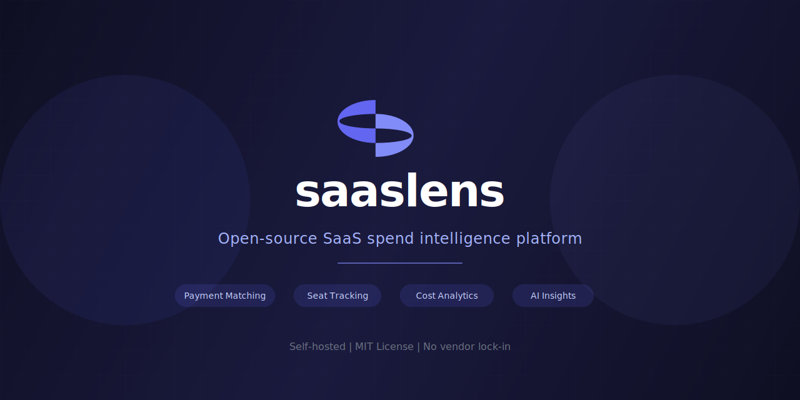
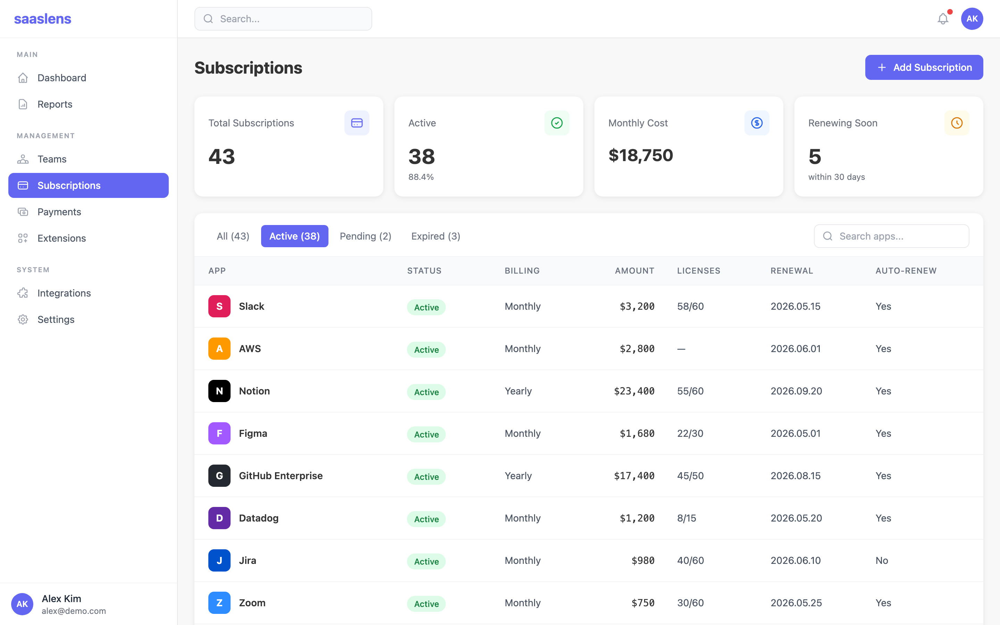
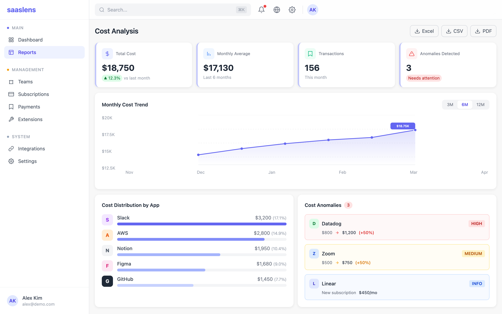
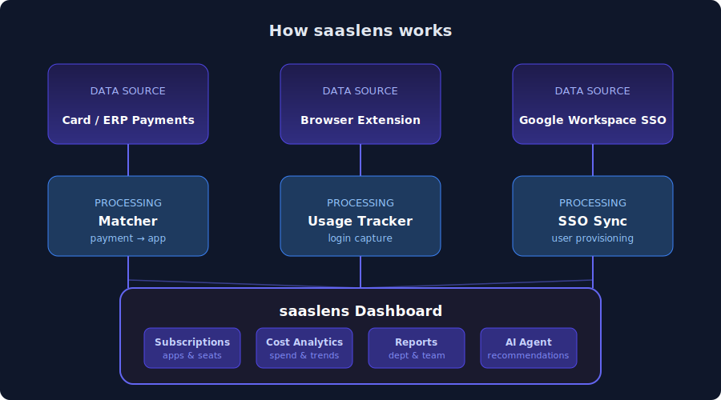

<p align="center">
  <a href="https://github.com/Wondermove-Inc/saaslens">
    
  </a>
</p>

<p align="center">
  <a href="README.md">English</a> · <a href="README.ko.md">한국어</a> · <a href="README.ja.md">日本語</a> · <a href="README.zh-CN.md">中文</a>
</p>

<p align="center">
  <strong>Open-source SaaS spend intelligence platform.</strong><br/>
  Discover unused subscriptions. Match payments to apps. Manage seats and costs — all self-hosted.
</p>

<p align="center">
  <a href="https://github.com/Wondermove-Inc/saaslens/actions/workflows/ci.yml"></a>
  <a href="LICENSE"></a>
  <a href="https://github.com/Wondermove-Inc/saaslens/stargazers"></a>
  <a href="https://github.com/Wondermove-Inc/saaslens/graphs/contributors"></a>
  <a href="https://github.com/Wondermove-Inc/saaslens/commits"></a>
</p>

<p align="center">
  <a href="#quick-start">Quick Start</a> &middot;
  <a href="#features">Features</a> &middot;
  <a href="docs/guide/">Documentation</a> &middot;
  <a href="#roadmap">Roadmap</a> &middot;
  <a href="CONTRIBUTING.md">Contributing</a>
</p>

---

<p align="center">
  <sub>If you find saaslens useful, please consider giving it a <a href="https://github.com/Wondermove-Inc/saaslens">star</a>. It helps others discover the project.</sub>
</p>

https://github.com/user-attachments/assets/47632ce2-cef5-4e8d-90a1-d4c6627099b3

## Why saaslens

Small and mid-size teams commonly run dozens of SaaS tools, but no one has a single place that answers three questions at the same time:

- **Which apps are we paying for?**
- **Which seats are still used, and which are not?**
- **Are the payments on the corporate card really matched to those apps?**

Commercial SaaS management tools like Zylo, Productiv, or Cleanspend solve this — but they lock in your billing data, charge per-seat fees, and add yet another SaaS to manage your SaaS.

**saaslens** is the open-source alternative. It reconciles payment feeds against discovered SaaS apps, tracks seat utilization with an optional browser extension, and surfaces unused seats, anomalous spend, and opportunities to consolidate — all **self-hosted**, with **your data staying on your infrastructure**.

## Features

<table>
<tr>
<td width="50%">

### Subscription & App Inventory

Maintain a single source of truth for every SaaS app your organization uses. Auto-discover apps through payment feeds, SSO, and browser extension data.

</td>
<td width="50%">

### Payment-to-App Matching

Automatically match corporate card and ERP payment lines to known SaaS apps. Normalizes merchant descriptors and supports regional presets (e.g. Korean card issuers).

</td>
</tr>
<tr>
<td width="50%">

### Seat & Usage Tracking

Track who has access to what. Identify unused seats from offboarded employees, monitor utilization rates, and reclaim licenses before the next billing cycle.

</td>
<td width="50%">

### Department Cost Analytics

Break down SaaS spend by department, team, or cost center. Spot trends, flag anomalies, and generate reports for finance reviews.

</td>
</tr>
<tr>
<td width="50%">

### Browser Extension

Optional Chrome extension that passively captures SaaS login activity. Discovers shadow IT — apps paid through personal cards that aren't centrally tracked.

</td>
<td width="50%">

### AI-Powered Insights

Built-in AI agent that analyzes your SaaS portfolio and recommends optimizations: consolidate overlapping tools, renegotiate contracts, or reclaim unused seats.

</td>
</tr>
</table>

<p align="center">
  
  <br/><sub>Subscription management with payment matching and seat tracking</sub>
</p>

<p align="center">
  
  <br/><sub>Cost analysis with anomaly detection and spend distribution</sub>
</p>

## How it works

<p align="center">
  
</p>

1. **Ingest payments** via CSV/ERP import or a bank/card connector. The matcher normalizes merchant descriptors and pairs them with known SaaS apps (default catalog + user overrides).
2. **Capture usage** from Google Workspace SSO, the optional Chrome extension that observes logins, or manual entry.
3. **Reconcile** payments, seats, and departments in one canonical model — multi-tenant from day one.
4. **Act** from the dashboard: mark an app unused, reclaim a seat from an offboarded user, flag spend anomalies, or ask the AI agent for recommendations.

## Example use case

> A 60-person engineering team uses 43 SaaS products. Finance sees 37 monthly payment lines but cannot tell which lines correspond to which products, and Slack invites keep growing while there is no record of who left the team.

Running saaslens, they connect their card feed and enable Google Workspace SSO. Within the first hour:

- 37 payment lines are matched to 35 distinct SaaS apps (2 duplicates).
- The browser extension finds 6 previously-unknown apps paid through employee cards.
- SSO sync reveals 11 seats still provisioned for people who left last quarter.
- The dashboard estimates **~$2,500/month of unused-seat spend**.

Finance consolidates two overlapping tools and reclaims the 11 stale seats — without adding another commercial SaaS to the stack.

## Comparison

| Feature               | saaslens |  Zylo  | Productiv | Cleanspend |
| --------------------- | :------: | :----: | :-------: | :--------: |
| Open source           | **Yes**  |   No   |    No     |     No     |
| Self-hosted           | **Yes**  |   No   |    No     |     No     |
| Data ownership        | **100%** | Vendor |  Vendor   |   Vendor   |
| Payment matching      | **Yes**  |  Yes   |  Limited  |    Yes     |
| Seat tracking         | **Yes**  |  Yes   |    Yes    |     No     |
| AI recommendations    | **Yes**  |  Yes   |    Yes    |     No     |
| Browser extension     | **Yes**  |   No   |    Yes    |     No     |
| Multi-tenant          | **Yes**  |  Yes   |    Yes    |    Yes     |
| Per-seat pricing      | **Free** |  $$$   |    $$$    |     $$     |
| Regional presets (KR) | **Yes**  |   No   |    No     |     No     |

## Tech Stack

| Layer    | Technology                                      |
| -------- | ----------------------------------------------- |
| Frontend | Next.js 15 (App Router) + React 19 + TypeScript |
| UI       | Shadcn/ui + Radix + Tailwind CSS 4              |
| Data     | Refine 5 + TanStack React Query/Table           |
| Auth     | NextAuth 5 + Prisma Adapter                     |
| ORM      | Prisma 6 / PostgreSQL                           |
| AI       | Anthropic AI SDK + Vercel AI SDK                |
| Cache    | Upstash Redis                                   |

## Quick Start

### Option A: Docker (recommended)

```bash
git clone https://github.com/Wondermove-Inc/saaslens.git
cd saaslens
docker compose up -d
# → http://localhost:3000
```

### Option B: Local

Requirements: **Node.js 20+**, **PostgreSQL 14+**.

```bash
git clone https://github.com/Wondermove-Inc/saaslens.git
cd saaslens

npm install --legacy-peer-deps
# Note: --legacy-peer-deps is needed due to React 19 peer dependency
# resolution with some third-party packages. Does not affect functionality.

cp .env.example .env.local
# Required: DATABASE_URL, NEXTAUTH_SECRET, NEXTAUTH_URL

npx prisma migrate deploy
npx prisma generate

npm run dev
# → http://localhost:3000
```

<details>
<summary><strong>Environment Variables</strong></summary>

Copy `.env.example` to `.env.local` and fill in the values you need. The app boots with only the required variables; optional integrations degrade gracefully when their vars are missing.

**Required**

| Variable          | Purpose                                          |
| ----------------- | ------------------------------------------------ |
| `DATABASE_URL`    | PostgreSQL connection string (Supabase works)    |
| `NEXTAUTH_SECRET` | NextAuth session encryption (>= 32 bytes random) |
| `NEXTAUTH_URL`    | Canonical app URL (e.g. `http://localhost:3000`) |

Generate a `NEXTAUTH_SECRET` with `openssl rand -base64 32`.

**Required for Google sign-in**

| Variable               | Purpose                    |
| ---------------------- | -------------------------- |
| `GOOGLE_CLIENT_ID`     | Google OAuth client ID     |
| `GOOGLE_CLIENT_SECRET` | Google OAuth client secret |

**Optional integrations**

| Feature                              | Variables                                                                       |
| ------------------------------------ | ------------------------------------------------------------------------------- |
| Upstash Redis (rate limiting, cache) | `UPSTASH_REDIS_REST_URL`, `UPSTASH_REDIS_REST_TOKEN`                            |
| Resend (email)                       | `RESEND_API_KEY`, `EMAIL_FROM`, `EMAIL_FROM_NAME`                               |
| Google Workspace Admin SDK (SSO)     | `GOOGLE_ADMIN_CLIENT_EMAIL`, `GOOGLE_ADMIN_PRIVATE_KEY`, `GOOGLE_ADMIN_SUBJECT` |
| Cloudflare R2 (file storage)         | `R2_ACCOUNT_ID`, `R2_ACCESS_KEY_ID`, `R2_SECRET_ACCESS_KEY`, `R2_BUCKET_NAME`   |
| OpenAI (SaaS classification LLM)     | `OPENAI_API_KEY`, `OPENAI_FAST_MODEL` (default: `gpt-4o-mini`)                  |
| FleetDM (device management)          | `FLEETDM_API_URL`, `FLEETDM_API_TOKEN`                                          |
| Vercel Cron                          | `CRON_SECRET`                                                                   |
| Feature flags                        | `ENABLE_REFINE` (Refine UI), `ENABLE_V2_FEATURES` (Tasks/Kanban)                |

See `.env.example` for the complete list.

</details>

<details>
<summary><strong>UI Components (shadcn)</strong></summary>

The 46+ shadcn-style components are **vendored into `packages/ui-registry/`** — you do **not** need the shadcn CLI at runtime.

```bash
npx shadcn@latest add <component-name>
```

</details>

## Architecture

```
Next.js App Router
├── (auth)/            — login, signup, invite, password reset
├── (dashboard)/       — main app (subscriptions, payments, users, teams, reports)
├── super-admin/       — tenant/admin management
└── api/v1/            — REST API

src/lib/
├── services/          — business logic (matcher, notification, hyphen/*, …)
├── config/presets/    — regional presets (e.g. Korean card issuers)
└── …
```

## Roadmap

- [ ] **v0.1** — Initial public release (Q2 2026)
- [ ] **v0.2** — Plugin system for payment integrations (Q3 2026)
- [ ] **v0.3** — Self-host Docker Compose quickstart (Q3 2026)
- [ ] **v1.0** — Stable API, i18n beyond EN/KO (Q4 2026)

See the [milestones](../../milestones) for detailed tracking. Have an idea? [Open a discussion](../../discussions).

## Community

- [GitHub Discussions](../../discussions) — Ask questions and share ideas
- [GitHub Issues](../../issues) — Report bugs and request features
- [CONTRIBUTING.md](CONTRIBUTING.md) — How to contribute

## Documentation

- [Development guide](docs/guide/) — TDD, Shadcn rules, deployment, audit logging
- [CONTRIBUTING](CONTRIBUTING.md)
- [SECURITY](SECURITY.md)
- [CHANGELOG](CHANGELOG.md)

## Contributing

We welcome contributions of all kinds. See [CONTRIBUTING.md](CONTRIBUTING.md) for how to get started.

Bug reports and feature requests via [GitHub Issues](../../issues). Vulnerability reports via [GitHub Security Advisories](../../security/advisories).

## License

MIT © 2026 Wondermove-Inc. See [LICENSE](LICENSE).
