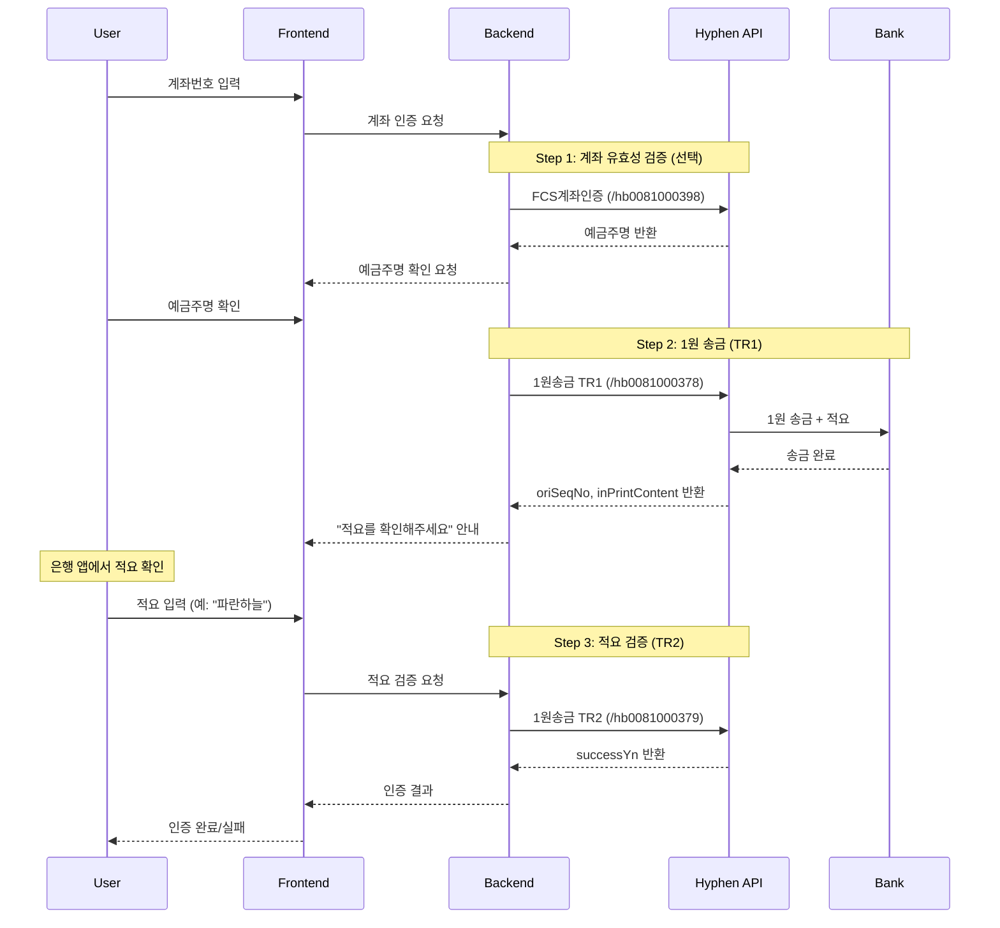

# 통장인증 (1원 인증) API 가이드

계좌 본인인증을 위한 Hyphen 1원 인증 API 연동 가이드입니다.

## 목차

1. [개요](#1-개요)
2. [사전 준비](#2-사전-준비)
3. [인증 (OAuth 2.0)](#3-인증-oauth-20)
4. [API 명세](#4-api-명세)
5. [인증 플로우](#5-인증-플로우)
6. [은행 코드표](#6-은행-코드표)
7. [활용 시나리오](#7-활용-시나리오)
8. [에러 처리 및 주의사항](#8-에러-처리-및-주의사항)

---

## 1. 개요

### 1.1 1원 인증이란?

1원 인증(계좌 본인인증)은 사용자의 계좌에 1원을 송금하고, 송금 시 함께 전송되는 **인증 적요(입금자명)**를 사용자가 확인하여 입력하는 방식의 본인인증입니다.

```
[인증 흐름]
1. 사용자가 본인 계좌번호 입력
2. 시스템이 해당 계좌로 1원 송금 (적요: "파란하늘" 등)
3. 사용자가 은행 앱/인터넷뱅킹에서 적요 확인
4. 사용자가 적요 입력하여 인증 완료
```

### 1.2 Hyphen 펌뱅킹 API

[Hyphen](https://hyphen.im)의 펌뱅킹 API를 통해 1원 인증을 구현할 수 있습니다.

- **API 문서**: https://hyphen.im/product-api/view?seq=31
- **지원 은행**: 국내 주요 은행 전체
- **인증 보안**: ISMS 정보보호 관리체계 인증

### 1.3 SaaS 관리 플랫폼에서의 활용

| 활용 목적          | 설명                               |
| ------------------ | ---------------------------------- |
| **결제 계좌 등록** | SaaS 구독료 결제용 계좌 본인 확인  |
| **환불 계좌 인증** | 환불금 입금 계좌 본인 확인         |
| **조직 계좌 등록** | 법인/팀 공용 계좌 등록 시 인증     |
| **보안 강화**      | 민감한 금융 정보 변경 시 추가 인증 |

### 1.4 제공 API 목록

| API             | Endpoint        | 기능                             |
| --------------- | --------------- | -------------------------------- |
| FCS계좌인증     | `/hb0081000398` | 계좌 유효성 검증 (예금주명 조회) |
| **1원송금 TR1** | `/hb0081000378` | 1원 송금 요청 (인증 시작)        |
| **1원송금 TR2** | `/hb0081000379` | 적요 검증 (인증 완료)            |

---

## 2. 사전 준비

### 2.1 Hyphen 회원가입 및 상품 신청

1. [Hyphen 회원가입](https://hyphen.im/user/sign-up)
2. 로그인 후 "1원 인증(계좌 본인인증)" 상품 신청
3. 인증 정보 발급 (이메일로 Hkey 전달)

### 2.2 요금제 선택

| 요금제          | 특징                  | 결제 방식                  |
| --------------- | --------------------- | -------------------------- |
| **TR 슬림**     | 계약서 없이 즉시 사용 | 비즈머니 충전 후 선불 차감 |
| **TR 시그니처** | 계약서 필요           | 후불 청구                  |

> **테스트**: 일 100건, 월 100건 무료 테스트 제공

### 2.3 인증 정보 준비

```
user_id: 회원가입 시 생성된 ID
hkey: 회원가입 후 이메일로 전달받은 보안키
```

---

## 3. 인증 (OAuth 2.0)

### 3.1 Access Token 발급

**Endpoint**

```
POST https://api.hyphen.im/oauth/token
```

**Request**

```typescript
// Header
{ "Content-Type": "application/json" }

// Body
{
  "user_id": "your_user_id",
  "hkey": "your_hkey"
}
```

**Response**

```json
{
  "access_token": "075a2d84-dab4-983e-a103-efb5d782b874",
  "token_type": "bearer",
  "expires_in": 603638,
  "scope": "read"
}
```

### 3.2 API 호출 방식

**OAuth 토큰 사용 (권장)**

```typescript
{
  "Authorization": "Bearer {access_token}",
  "Content-Type": "application/json"
}
```

**직접 인증 (대안)**

```typescript
{
  "user-id": "your_user_id",
  "Hkey": "your_hkey",
  "Content-Type": "application/json"
}
```

---

## 4. API 명세

### 4.1 FCS계좌인증 (계좌 유효성 검증)

계좌번호의 유효성을 확인하고 예금주명을 조회합니다. 1원 송금 전 사전 검증용으로 사용합니다.

**Endpoint**

```
POST https://api.hyphen.im/hb0081000398
```

**Request Body**

```typescript
interface AccountVerifyRequest {
  bank_cd: string; // 은행코드 3자리 (필수)
  acct_no: string; // 계좌번호 (필수)
  id_no?: string; // 신원확인번호 (생년월일 6자리 또는 사업자번호)
  amount?: string; // 금액 (가상계좌 조회 시 사용)
}
```

**Response**

```typescript
interface AccountVerifyResponse {
  name: string; // 예금주명
  reply: string; // 응답코드
  reply_msg: string; // 응답메시지
}
```

**JavaScript 예시**

```javascript
const verifyAccount = async (bankCode, accountNo) => {
  const response = await fetch("https://api.hyphen.im/hb0081000398", {
    method: "POST",
    headers: {
      "Content-Type": "application/json",
      Authorization: `Bearer ${accessToken}`,
    },
    body: JSON.stringify({
      bank_cd: bankCode, // "088" (신한은행)
      acct_no: accountNo, // "110123456789"
    }),
  });

  const data = await response.json();
  return data; // { name: "홍길동", reply: "0000", reply_msg: "정상" }
};
```

---

### 4.2 1원송금 TR1 (1원 송금 요청)

사용자 계좌로 1원을 송금하고 인증 적요를 전송합니다. **인증 프로세스의 첫 번째 단계**입니다.

**Endpoint**

```
POST https://api.hyphen.im/hb0081000378
```

**Request Body**

```typescript
interface OneWonTransferRequest {
  inBankCode: string; // 입금은행코드 (필수, 예: "088")
  inAccount: string; // 입금계좌번호 (필수)
  msgType?: string; // 인증적요 유형 (기본값: "1")
  // "1": 한글 4글자 (예: 파란하늘)
  // "2": 업체명 + 숫자 3자리 (예: SMP123)
  // "3": 직접 입력
  compName?: string; // 업체명 (최대 7자리, msgType=2일 때 필수)
  printContent?: string; // 직접입력 적요 (최대 10자리, msgType=3일 때 필수)
}
```

**Response**

```typescript
interface OneWonTransferResponse {
  replyCode: string; // 응답코드
  replyMessage: string; // 응답메시지
  sign: string; // 서명
  successYn: string; // 성공여부 ("Y" | "N")
  tradeTime: string; // 거래시간
  inPrintContent: string; // **인증 적요** (사용자에게 안내)
  svcCharge: string; // 서비스 수수료
  oriSeqNo: string; // **인증 검증 번호** (TR2에서 사용)
  tr_date: string; // 거래일자 (yyyy-mm-dd)
  error?: string; // 에러 메시지
}
```

**JavaScript 예시**

```javascript
const sendOneWon = async (bankCode, accountNo) => {
  const response = await fetch("https://api.hyphen.im/hb0081000378", {
    method: "POST",
    headers: {
      "Content-Type": "application/json",
      Authorization: `Bearer ${accessToken}`,
    },
    body: JSON.stringify({
      inBankCode: bankCode, // "088"
      inAccount: accountNo, // "110123456789"
      msgType: "1", // 한글 4글자 적요
    }),
  });

  const data = await response.json();

  if (data.successYn === "Y") {
    // 인증 정보 저장 (TR2에서 사용)
    return {
      oriSeqNo: data.oriSeqNo, // 인증 검증 번호
      inPrintContent: data.inPrintContent, // 정답 적요 (서버에만 저장)
      tr_date: data.tr_date, // 거래일자
    };
  }

  throw new Error(data.error || data.replyMessage);
};
```

---

### 4.3 1원송금 TR2 (적요 검증)

사용자가 입력한 적요를 검증하여 인증을 완료합니다. **인증 프로세스의 두 번째 단계**입니다.

**Endpoint**

```
POST https://api.hyphen.im/hb0081000379
```

**Request Body**

```typescript
interface VerifyPrintContentRequest {
  oriSeqNo: string; // 인증 검증 번호 (TR1에서 받은 값, 필수)
  inPrintContent: string; // 사용자가 입력한 적요 (필수)
  // ⚠️ 5분 이내 입력 필요
  tr_date?: string; // 거래일자 (yyyy-mm-dd)
}
```

**Response**

```typescript
interface VerifyPrintContentResponse {
  successYn: string; // 인증 성공 여부 ("Y" | "N")
  error?: string; // 에러 메시지
}
```

**JavaScript 예시**

```javascript
const verifyPrintContent = async (oriSeqNo, userInput, trDate) => {
  const response = await fetch("https://api.hyphen.im/hb0081000379", {
    method: "POST",
    headers: {
      "Content-Type": "application/json",
      Authorization: `Bearer ${accessToken}`,
    },
    body: JSON.stringify({
      oriSeqNo: oriSeqNo, // TR1에서 받은 값
      inPrintContent: userInput, // 사용자가 입력한 적요 (예: "파란하늘")
      tr_date: trDate, // "2024-11-30"
    }),
  });

  const data = await response.json();

  if (data.successYn === "Y") {
    return { verified: true };
  }

  return { verified: false, error: data.error };
};
```

---

## 5. 인증 플로우

### 5.1 전체 인증 프로세스



### 5.2 구현 예시 (Next.js Server Action)

```typescript
// src/actions/bank-verification.ts
"use server";

import { prisma } from "@/lib/db";

interface BankVerificationState {
  step: "input" | "verify" | "complete";
  accountName?: string;
  oriSeqNo?: string;
  trDate?: string;
  error?: string;
}

// Step 1: 1원 송금 요청
export async function requestOneWonTransfer(
  bankCode: string,
  accountNo: string,
  userId: string
): Promise<BankVerificationState> {
  const accessToken = await getHyphenToken();

  // 1원 송금 요청 (TR1)
  const response = await fetch("https://api.hyphen.im/hb0081000378", {
    method: "POST",
    headers: {
      "Content-Type": "application/json",
      Authorization: `Bearer ${accessToken}`,
    },
    body: JSON.stringify({
      inBankCode: bankCode,
      inAccount: accountNo,
      msgType: "2",
      compName: "SMP", // SaaS Management Platform
    }),
  });

  const data = await response.json();

  if (data.successYn !== "Y") {
    return { step: "input", error: data.error || "송금 요청 실패" };
  }

  // 인증 세션 저장 (5분 유효)
  await prisma.bankVerificationSession.create({
    data: {
      userId,
      bankCode,
      accountNo,
      oriSeqNo: data.oriSeqNo,
      inPrintContent: data.inPrintContent, // 정답 (서버에만 저장)
      trDate: data.tr_date,
      expiresAt: new Date(Date.now() + 5 * 60 * 1000), // 5분
    },
  });

  return {
    step: "verify",
    oriSeqNo: data.oriSeqNo,
    trDate: data.tr_date,
  };
}

// Step 2: 적요 검증
export async function verifyPrintContent(
  oriSeqNo: string,
  userInput: string,
  userId: string
): Promise<BankVerificationState> {
  const session = await prisma.bankVerificationSession.findFirst({
    where: {
      userId,
      oriSeqNo,
      expiresAt: { gt: new Date() },
    },
  });

  if (!session) {
    return { step: "input", error: "인증 세션이 만료되었습니다." };
  }

  const accessToken = await getHyphenToken();

  // 적요 검증 (TR2)
  const response = await fetch("https://api.hyphen.im/hb0081000379", {
    method: "POST",
    headers: {
      "Content-Type": "application/json",
      Authorization: `Bearer ${accessToken}`,
    },
    body: JSON.stringify({
      oriSeqNo,
      inPrintContent: userInput,
      tr_date: session.trDate,
    }),
  });

  const data = await response.json();

  if (data.successYn === "Y") {
    // 인증 완료 - 계좌 정보 저장
    await prisma.verifiedBankAccount.create({
      data: {
        userId,
        bankCode: session.bankCode,
        accountNo: session.accountNo,
        verifiedAt: new Date(),
      },
    });

    // 세션 삭제
    await prisma.bankVerificationSession.delete({
      where: { id: session.id },
    });

    return { step: "complete" };
  }

  return {
    step: "verify",
    oriSeqNo,
    trDate: session.trDate,
    error: "적요가 일치하지 않습니다. 다시 확인해주세요.",
  };
}
```

### 5.3 프론트엔드 컴포넌트 예시

```tsx
// src/components/BankVerification.tsx
"use client";

import { useState } from "react";
import { Button } from "@/components/ui/button";
import { Input } from "@/components/ui/input";
import {
  Select,
  SelectContent,
  SelectItem,
  SelectTrigger,
  SelectValue,
} from "@/components/ui/select";
import {
  requestOneWonTransfer,
  verifyPrintContent,
} from "@/actions/bank-verification";
import { BANK_CODES } from "@/lib/constants";

export function BankVerification({ userId }: { userId: string }) {
  const [step, setStep] = useState<"input" | "verify" | "complete">("input");
  const [bankCode, setBankCode] = useState("");
  const [accountNo, setAccountNo] = useState("");
  const [printContent, setPrintContent] = useState("");
  const [oriSeqNo, setOriSeqNo] = useState("");
  const [error, setError] = useState("");
  const [loading, setLoading] = useState(false);

  const handleRequestTransfer = async () => {
    setLoading(true);
    setError("");

    const result = await requestOneWonTransfer(bankCode, accountNo, userId);

    if (result.error) {
      setError(result.error);
    } else if (result.step === "verify") {
      setOriSeqNo(result.oriSeqNo!);
      setStep("verify");
    }

    setLoading(false);
  };

  const handleVerify = async () => {
    setLoading(true);
    setError("");

    const result = await verifyPrintContent(oriSeqNo, printContent, userId);

    if (result.error) {
      setError(result.error);
    } else if (result.step === "complete") {
      setStep("complete");
    }

    setLoading(false);
  };

  if (step === "complete") {
    return (
      <div className="p-4 text-center">
        <p className="font-medium text-green-600">
          계좌 인증이 완료되었습니다.
        </p>
      </div>
    );
  }

  return (
    <div className="space-y-4 p-4">
      {step === "input" && (
        <>
          <Select value={bankCode} onValueChange={setBankCode}>
            <SelectTrigger>
              <SelectValue placeholder="은행 선택" />
            </SelectTrigger>
            <SelectContent>
              {BANK_CODES.map((bank) => (
                <SelectItem key={bank.code} value={bank.code}>
                  {bank.name}
                </SelectItem>
              ))}
            </SelectContent>
          </Select>

          <Input
            placeholder="계좌번호 (- 없이 입력)"
            value={accountNo}
            onChange={(e) => setAccountNo(e.target.value.replace(/\D/g, ""))}
          />

          <Button
            onClick={handleRequestTransfer}
            disabled={loading || !bankCode || !accountNo}
          >
            {loading ? "처리중..." : "1원 인증 요청"}
          </Button>
        </>
      )}

      {step === "verify" && (
        <>
          <p className="text-muted-foreground text-sm">
            입력하신 계좌로 1원을 송금했습니다.
            <br />
            은행 앱에서 입금내역의 <strong>입금자명(적요)</strong>을 확인하고
            입력해주세요.
          </p>
          <p className="text-muted-foreground text-xs">
            ⏱️ 5분 이내에 입력해주세요.
          </p>

          <Input
            placeholder="입금자명 입력 (예: SMP123)"
            value={printContent}
            onChange={(e) => setPrintContent(e.target.value)}
          />

          <Button onClick={handleVerify} disabled={loading || !printContent}>
            {loading ? "확인중..." : "인증 완료"}
          </Button>
        </>
      )}

      {error && <p className="text-destructive text-sm">{error}</p>}
    </div>
  );
}
```

---

## 6. 은행 코드표

### 6.1 주요 은행 코드 (3자리)

| 코드 | 은행명     | 코드 | 은행명       |
| ---- | ---------- | ---- | ------------ |
| 001  | 한국은행   | 020  | 우리은행     |
| 002  | 산업은행   | 023  | SC제일은행   |
| 003  | 기업은행   | 027  | 한국씨티은행 |
| 004  | 국민은행   | 031  | 대구은행     |
| 007  | 수협은행   | 032  | 부산은행     |
| 008  | 수출입은행 | 034  | 광주은행     |
| 011  | NH농협은행 | 035  | 제주은행     |
| 012  | 지역농축협 | 037  | 전북은행     |
| 020  | 우리은행   | 039  | 경남은행     |
| 081  | 하나은행   | 045  | 새마을금고   |
| 088  | 신한은행   | 048  | 신협         |
| 089  | 케이뱅크   | 050  | 저축은행     |
| 090  | 카카오뱅크 | 071  | 우체국       |
| 092  | 토스뱅크   | -    | -            |

### 6.2 은행 코드 상수 정의

```typescript
// src/lib/constants/bank-codes.ts
export const BANK_CODES = [
  { code: "004", name: "국민은행" },
  { code: "088", name: "신한은행" },
  { code: "020", name: "우리은행" },
  { code: "081", name: "하나은행" },
  { code: "011", name: "NH농협은행" },
  { code: "003", name: "기업은행" },
  { code: "090", name: "카카오뱅크" },
  { code: "089", name: "케이뱅크" },
  { code: "092", name: "토스뱅크" },
  { code: "023", name: "SC제일은행" },
  { code: "031", name: "대구은행" },
  { code: "032", name: "부산은행" },
  { code: "034", name: "광주은행" },
  { code: "037", name: "전북은행" },
  { code: "039", name: "경남은행" },
  { code: "035", name: "제주은행" },
  { code: "071", name: "우체국" },
  { code: "045", name: "새마을금고" },
  { code: "048", name: "신협" },
] as const;

export type BankCode = (typeof BANK_CODES)[number]["code"];
```

---

## 7. 활용 시나리오

### 7.1 결제 계좌 등록 플로우

```typescript
// 사용자가 SaaS 구독료 자동결제용 계좌 등록 시
async function registerPaymentAccount(
  userId: string,
  bankCode: string,
  accountNo: string
) {
  // 1. 계좌 유효성 검증
  const accountInfo = await verifyAccount(bankCode, accountNo);

  // 2. 1원 인증 진행
  const transfer = await requestOneWonTransfer(bankCode, accountNo, userId);

  // 3. 사용자 적요 입력 대기...

  // 4. 인증 완료 후 계좌 등록
  await prisma.paymentAccount.create({
    data: {
      userId,
      bankCode,
      accountNo,
      accountHolder: accountInfo.name,
      isVerified: true,
    },
  });
}
```

### 7.2 조직 결제 수단 관리

```typescript
// 조직 관리자가 팀 결제 계좌 등록 시
async function registerOrganizationAccount(
  organizationId: string,
  adminUserId: string,
  bankCode: string,
  accountNo: string
) {
  // 관리자 권한 확인
  const isAdmin = await checkOrganizationAdmin(organizationId, adminUserId);
  if (!isAdmin) throw new Error("권한이 없습니다.");

  // 1원 인증 진행
  const result = await performOneWonVerification(
    bankCode,
    accountNo,
    adminUserId
  );

  if (result.verified) {
    await prisma.organization.update({
      where: { id: organizationId },
      data: {
        paymentBankCode: bankCode,
        paymentAccountNo: accountNo,
        paymentAccountVerifiedAt: new Date(),
        paymentAccountVerifiedBy: adminUserId,
      },
    });
  }
}
```

---

## 8. 에러 처리 및 주의사항

### 8.1 주요 에러 케이스

| 상황           | 원인                           | 대응                        |
| -------------- | ------------------------------ | --------------------------- |
| 계좌 조회 실패 | 잘못된 계좌번호/은행코드       | 입력값 재확인 안내          |
| 송금 실패      | 계좌 상태 이상 (해지, 정지 등) | 다른 계좌 사용 안내         |
| 적요 불일치    | 사용자 입력 오류               | 재입력 안내 (3회 제한 권장) |
| 시간 초과      | 5분 내 미입력                  | 처음부터 재시작             |

### 8.2 적요 입력 시간 제한

```
⚠️ 중요: 적요 입력은 1원 송금 후 5분 이내에 완료해야 합니다.
```

```typescript
// 세션 만료 체크
function isSessionExpired(createdAt: Date): boolean {
  const FIVE_MINUTES = 5 * 60 * 1000;
  return Date.now() - createdAt.getTime() > FIVE_MINUTES;
}
```

### 8.3 보안 주의사항

```
⚠️ 보안 주의사항

1. 인증 정답(inPrintContent)은 절대 클라이언트에 노출하지 않음
2. oriSeqNo는 서버에서만 검증에 사용
3. 인증 세션은 사용자별로 격리 관리
4. 재시도 횟수 제한 (3~5회 권장)
5. Hyphen 인증 정보(hkey)는 환경변수로 관리
```

```typescript
// .env 설정
HYPHEN_USER_ID = your_user_id;
HYPHEN_HKEY = your_hkey;
```

### 8.4 인증 실패 시 재시도 제한

```typescript
// 재시도 횟수 관리
const MAX_RETRY = 3;

async function verifyWithRetryLimit(
  userId: string,
  oriSeqNo: string,
  userInput: string
) {
  const session = await prisma.bankVerificationSession.findFirst({
    where: { userId, oriSeqNo },
  });

  if (!session) {
    throw new Error("세션을 찾을 수 없습니다.");
  }

  if (session.retryCount >= MAX_RETRY) {
    await prisma.bankVerificationSession.delete({ where: { id: session.id } });
    throw new Error(
      "인증 시도 횟수를 초과했습니다. 처음부터 다시 시도해주세요."
    );
  }

  const result = await verifyPrintContent(oriSeqNo, userInput, userId);

  if (!result.verified) {
    await prisma.bankVerificationSession.update({
      where: { id: session.id },
      data: { retryCount: session.retryCount + 1 },
    });
  }

  return result;
}
```

### 8.5 테스트 환경

- **무료 테스트**: 일 100건, 월 100건
- **테스트 시**: Header에 `hyphen-gustation: Y` 추가
- **실제 사용 시**: 해당 헤더 제거

---

## 참고 자료

- [Hyphen 1원 인증 API 명세서](https://hyphen.im/product-api/view?seq=31#product-api-specification)
- [Hyphen OAuth 2.0 가이드](https://hyphen.im/product-api/view?seq=31#product-api-oauth)
- [Hyphen 코드 리스트](https://hyphen.im/product-api/view?seq=31#product-api-code)
- [펌뱅킹 은행응답코드 (Excel)](https://kr.object.ncloudstorage.com/synctree/datamarket/static/product/codezip/%5BHYPHEN%5D%20%EC%8B%A4%EC%8B%9C%EA%B0%84%20%ED%8E%8C%EB%B1%85%ED%82%B9%20%EC%9D%80%ED%96%89%EC%9D%91%EB%8B%B5%EC%BD%94%EB%93%9C.xlsx)

---

**고객센터**

- 전화: 1600-4173 (1번: 펌뱅킹)
- 이메일: fbs@hyphen.im (펌뱅킹), help@hyphen.im (API마켓)
- 상담시간: 평일 08:30 ~ 17:30
